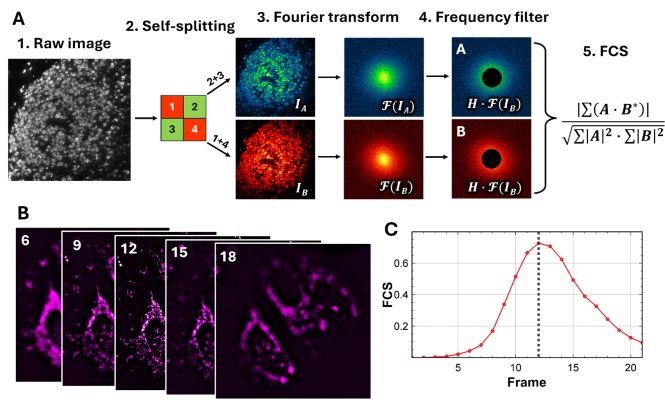

# Fourier Coherence Score

## A Reference-Free Metric for Quantitative Microscopy Image Quality Assessment

Reliable microscopy measurements depend on images that preserve biologically
meaningful structural information. Assessing that quality is difficult because
noise, optical blur, signal level, and the amount of structure can change
independently, while many conventional metrics respond differently to each of
these factors.

The **Fourier Coherence Score (FCS)** is a reference-free and training-free
measure of structural image quality calculated directly from a single image.
It divides the image into two complementary interleaved samplings and measures
their normalized correlation in a selected Fourier-frequency band. Because
genuine image structure is coherently represented in both samplings while
uncorrelated noise is not, FCS provides a normalized score from **0 to 1**;
higher values indicate stronger, more consistently supported structural
information.

Numerical evaluation across point-spread-function width, signal-to-noise ratio,
signal intensity, and structural quantity showed that FCS tracks image-quality
improvements consistently across these distinct determinants. The framework
also supports regional quality mapping within a field of view and focus
assessment across fluorescence, bright-field, hematoxylin and eosin, and
quantitative phase microscopy. This repository provides an ImageJ/Fiji plugin
for applying FCS to individual images and image stacks.

## Principle



*Principle of the Fourier Coherence Score. (A) The input image is separated
into two complementary interleaved representations. Their Fourier transforms
are restricted to a prescribed spatial-frequency band and compared using a
normalized cross-correlation. (B) Representative planes from a microscopy
image stack. (C) The corresponding FCS profile, in which the maximum identifies
the slice with the strongest coherently supported structural information.*

This self-referenced calculation does not require a ground-truth image, a
separate reference acquisition, or a trained model.

## Features

### Single image

- Calculates FCS in overlapping image regions.
- Generates a spatially resolved image-quality map.
- Supports region sizes from 64 x 64 to 1024 x 1024 pixels.
- Provides optional regularization and an optional regional results table.

### Image stack: FCS across stack

- Calculates one FCS value for every slice.
- Displays the FCS-versus-slice plot and results table.
- Reports and displays the slice with the highest FCS.

### Image stack: region-wise refocusing

- Calculates local FCS throughout every slice.
- Generates a spatially resolved focus-depth map.
- Generates a regional FCS image-quality map.
- Reconstructs an all-in-focus image from the stack.
- Provides an optional regional results table.

## Requirements

- A grayscale image or grayscale image stack.
- **Fiji:** use the compiled `Fourier-Coherence-Score.jar`. It requires the
  legacy JTransforms package `edu.emory.mathcs.jtransforms`, which is commonly
  provided by `Fiji.app/jars/jtransforms.jar`.
- **ImageJ 1.x:** compile `Fourier_Coherence_Score_.java` after installing a
  compatible JTransforms library.

## Fiji installation — compiled JAR

1. Download [Fourier-Coherence-Score.jar](./Fourier-Coherence-Score.jar).
2. Close Fiji.
3. Copy the JAR into the Fiji plugins folder:

   ```text
   Fiji.app/plugins/
   ```

4. Confirm that `jtransforms.jar` is present in `Fiji.app/jars/`.
5. Restart Fiji.
6. Open a grayscale image or image stack.
7. Select **Plugins > Fourier Coherence Score**.

For example, a Windows installation at `E:\Fiji` should contain:

```text
E:\Fiji\plugins\Fourier-Coherence-Score.jar
E:\Fiji\jars\jtransforms.jar
```

## ImageJ installation — Java source

1. Close ImageJ.
2. Copy a compatible JTransforms JAR into the ImageJ plugins folder:

   ```text
   ImageJ/plugins/
   ```

3. Restart ImageJ so the dependency is added to its Java class path.
4. Select **Plugins > Compile and Run**.
5. Choose [Fourier_Coherence_Score_.java](./Fourier_Coherence_Score_.java).
6. Allow ImageJ to compile and run the plugin.
7. If the command does not appear immediately, restart ImageJ.
8. Run **Plugins > Fourier Coherence Score**.

The current Java source imports:

```java
edu.emory.mathcs.jtransforms.fft.FloatFFT_2D
```

It therefore compiles directly with legacy JTransforms 2.4. The file
`JTransforms-3.1-with-dependencies.jar` normally provides the newer namespace:

```java
org.jtransforms.fft.FloatFFT_2D
```

To compile against JTransforms 3.1, change the import in the Java source from
`edu.emory.mathcs.jtransforms.fft.FloatFFT_2D` to
`org.jtransforms.fft.FloatFFT_2D`. This namespace change is not needed when
installing the precompiled Fiji JAR.

Running the `.java` file in a Script Editor generally executes it only for the
current session. Use **Compile and Run** when you want ImageJ to compile it as a
reusable plugin.

## Usage

### Analyze a single image

1. Open a grayscale image.
2. Select **Plugins > Fourier Coherence Score**.
3. Choose the region size and largest feature included.
4. Enable the regularization term if needed.
5. Select whether to show the regional results table.
6. Select **OK**.

The plugin generates an `FCS_Image_Quality_Map` image. Higher map values
indicate regions with better image quality.

### Analyze an image stack

1. Open a grayscale image stack.
2. Select **Plugins > Fourier Coherence Score**.
3. Choose one of the following modes:

   - **FCS across stack**: calculates one score per slice and displays the
     highest-FCS slice.
   - **Region-wise refocusing**: generates the focus-depth map, regional image-
     quality map, and all-in-focus reconstruction.

4. Configure the displayed parameters and select **OK**.

## Main parameters

| Parameter | Description |
| --- | --- |
| Region size | Width and height of each local analysis window. Smaller regions provide finer spatial localization; larger regions provide more stable Fourier statistics. |
| Largest feature included | Largest spatial feature included in the evaluated Fourier-frequency band, expressed in pixels. The default value is 16 pixel.  |
| Enable regularization term | Applies virtual-noise regularization to reduce artificially high scores in high correlated regions. |
| Show regional results table | Displays the regional measurements used to generate the map. |


## Output names

Depending on the selected mode, the plugin produces:

- `FCS_Image_Quality_Map`
- `FCS_Regional_Results`
- `FCS Across Stack Results`
- `Highest FCS Slice`
- `Focus_Depth_Map`
- `FCS_AllInFocus`

## Source code

The editable plugin source is available in
[Fourier_Coherence_Score_.java](./Fourier_Coherence_Score_.java).

## Author

Hongqiang Ma

## License

This project is released under the [MIT License](./LICENSE).
